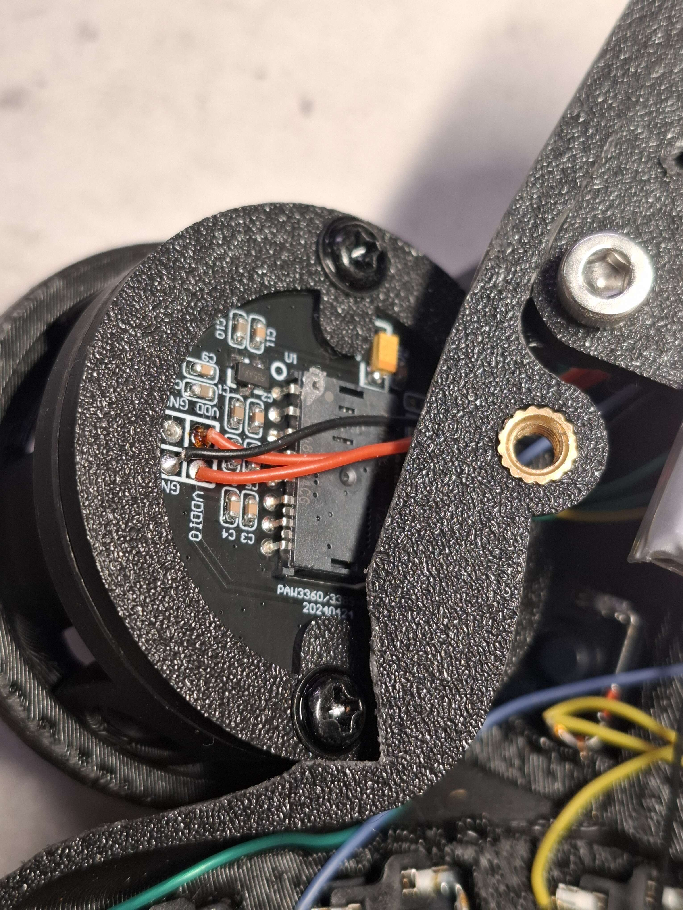
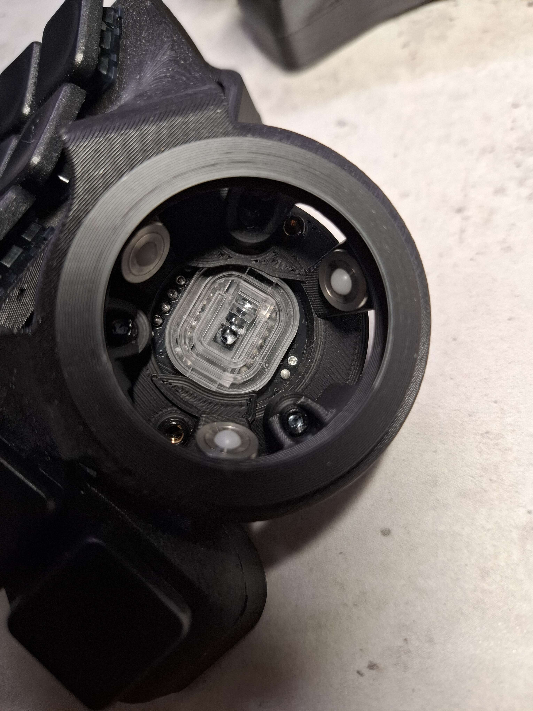
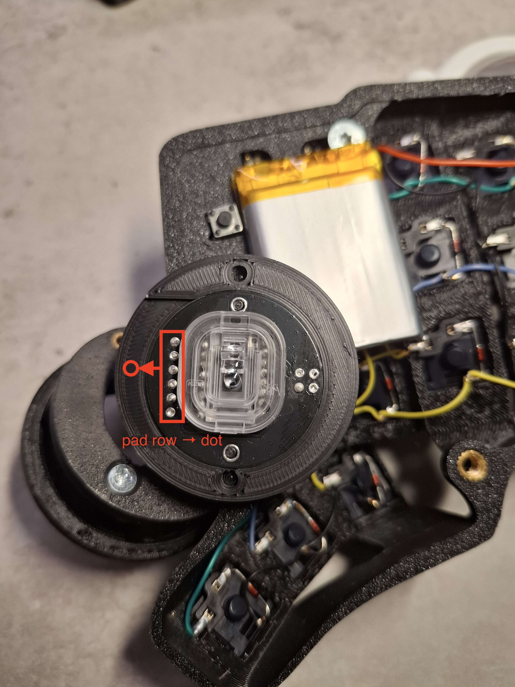

# Bottom Adapter Alternative Sensors

- [Bottom Adapter Alternative Sensors](#bottom-adapter-alternative-sensors)
  - [ADNS-9800](#adns-9800)
  - [PMW-3389](#pmw-3389)
  - [PAW3360 / PMW3389 module](#paw3360--pmw3389-module)
    - [Orientation](#orientation)

## ADNS-9800

[adapter_v2_bottom_adns_9800](./adapter_v2_bottom_adns_9800.stl)

## PMW-3389

[adapter_v2_bottom_pmw_3389](./adapter_v2_bottom_pmw_3389.stl)

## PAW3360 / PMW3389 module

An adapter for the cheap sensor module sold on AliExpress as a "PAW3360/3389-Module", silkscreened `20240424`. Unlike the two above it is not a bottom adapter of its own — it is a thin plate that screws onto an existing ball holder in place of the original sensor PCB.

[adapter_paw3360_3389_module_20240424](./adapter_paw3360_3389_module_20240424.stl)

The sensor position is taken from the original Bastardkb sensor PCB, so the lens sits in the same place and at the same distance from the ball. It was printed and used on the [Veichu M3 holder](../veichu/veichu_M3_screw.stl). The other holders have not been tested, but they are all built around the original PCB, so it should fit those as well.

### Orientation

The module is symmetric and drops into the adapter either way round, but only one way is right: the row of solder pads must face the dot embossed on the adapter. The board sits off-centre in the adapter and the sensor sits off-centre on the board — the two offsets cancel out only in this orientation. Turned 180° they add up and the sensor no longer looks at the centre of the ball.

*The photo was taken with an earlier print that had a cut-out where the dot is now; the dot and the markings are drawn on.*
