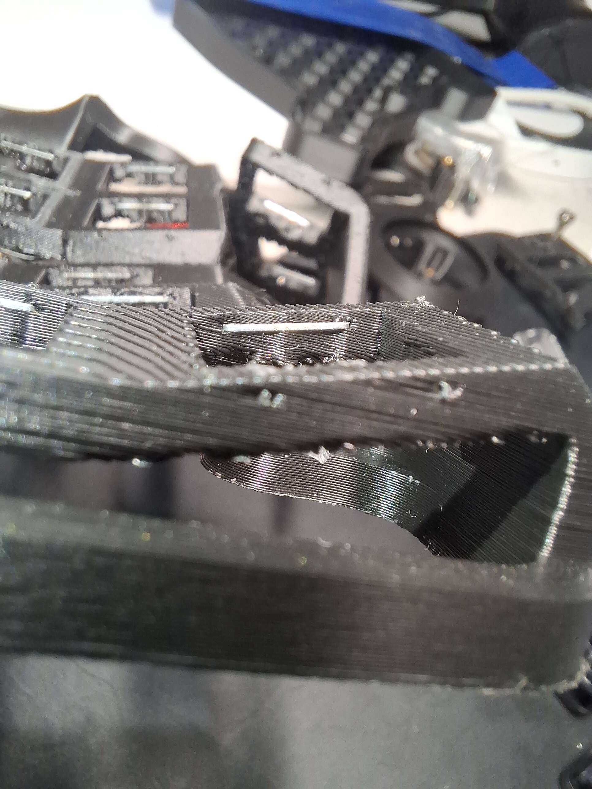
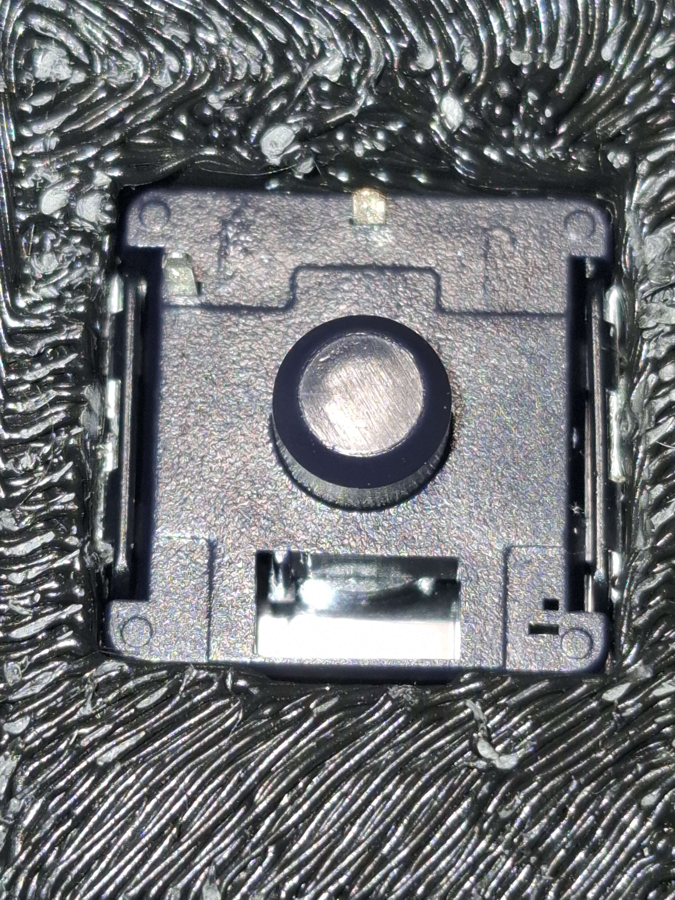
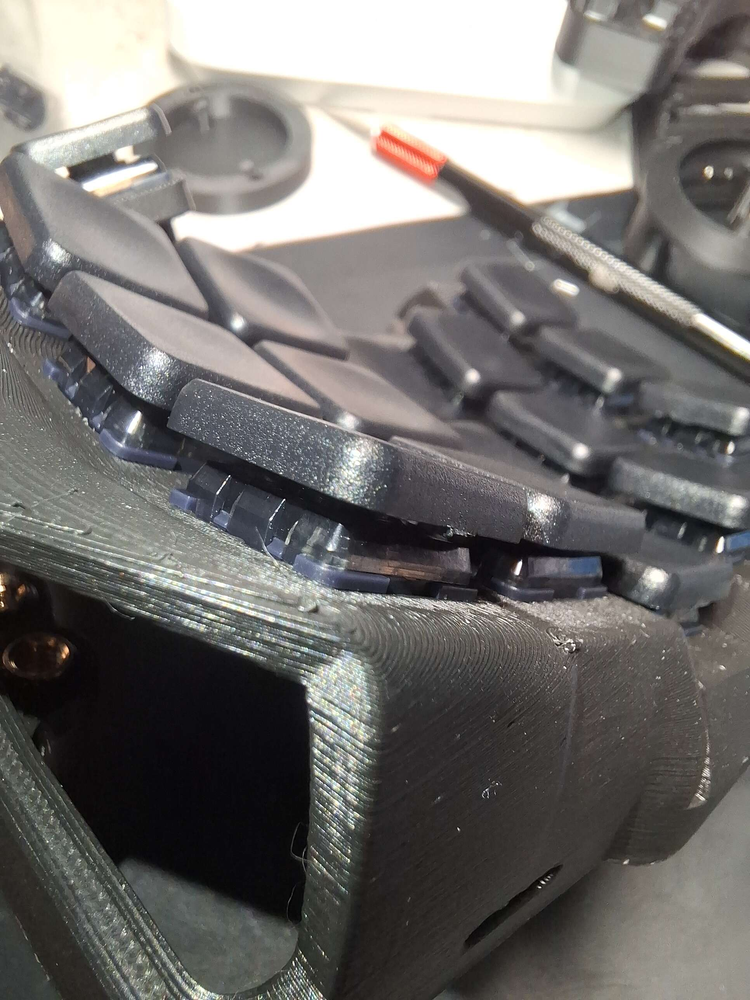
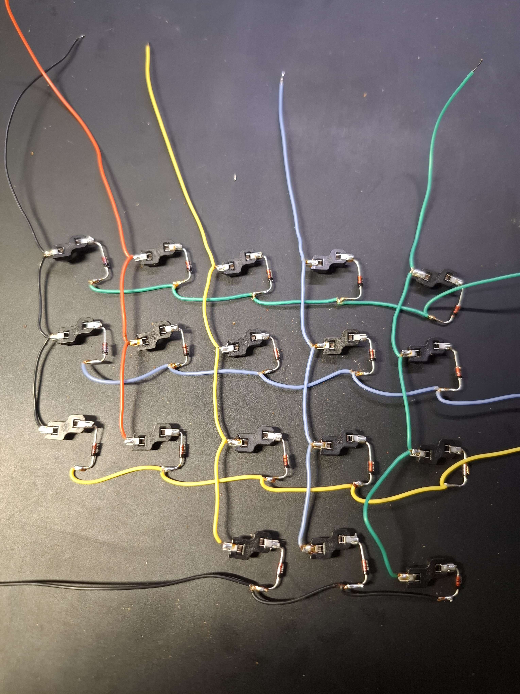
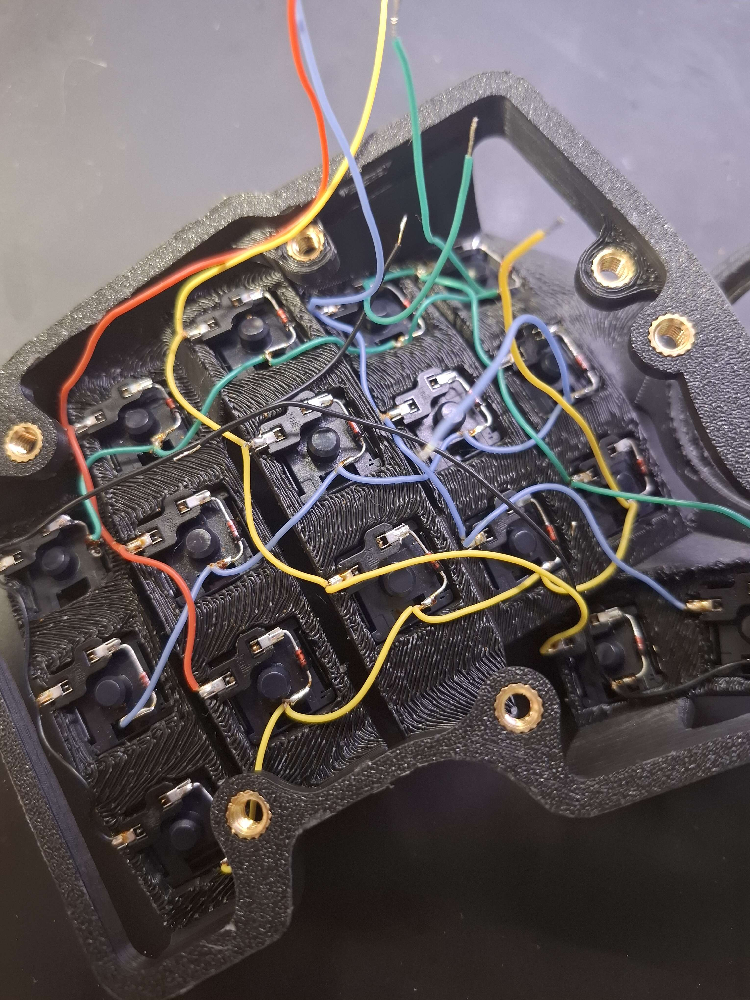
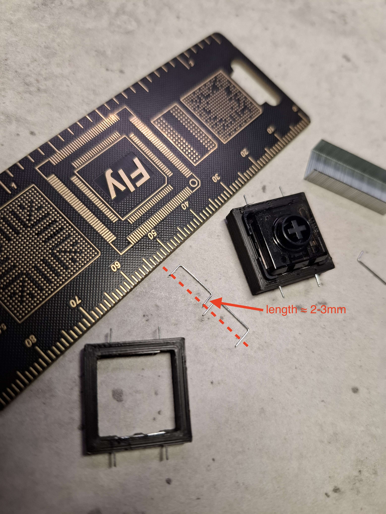
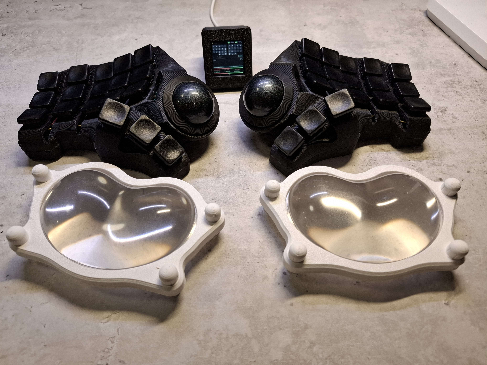

# Kailh PG1353 (Choc V2) switches

The stock Charybdis cases are cut for MX switches. This mod is the 3x5+3 high trackball case re-cut for Kailh PG1353, sold as Choc V2.

Cutting Choc-sized windows is not enough on its own. A PG1350 (Choc V1) latches into printed plastic well enough, but the PG1353 latches are much smaller and get no grip at all, so the switches drop straight back out of the window.

The fix is two ordinary stapler staples melted into each switch window, one down each side. The latch then catches on the metal strip instead of on the plastic, and that holds: nothing has fallen out since. Taking a switch back out means bending its latches in first, otherwise they snap off.

The holes for the staples are already in the case model.

A staple sitting in the switch window.

From below, with a switch fitted: the latches hook onto the staple.

How tightly the switches end up sitting in the case.

## Files

Modified from [3x5_3 high v2.stl](../../3x5%2B3/HighTrackball/3x5_3%20high%20v2.stl):

- [3x5_3_high_v2_pg1353_left.stl](./3x5_3_high_v2_pg1353_left.stl)
- [3x5_3_high_v2_pg1353_right.stl](./3x5_3_high_v2_pg1353_right.stl)

Each one also has a 3mf next to it, which is easier to open and edit.

The two halves are not mirror images of each other, so print both files as they are.

Read the section below before printing: this is one specific build, not a drop-in replacement for the stock case.

## How it differs from the stock case

**Choc-sized switch windows.** The stock case is cut for MX. Every window here is re-cut for Choc, with two extra holes per window for the staples.

**Hotswap sockets instead of a PCB.** The PG1353 body is shorter than the PG1350 and does not reach through the thickness of the case, so a PCB cannot meet the switch pins. Every switch has a Kailh hotswap socket soldered straight onto it and the matrix is hand wired. The socket sticks out to one side, and the case has small extra cut-outs for it. Those cut-outs are what stops the two halves from being mirror images.

**A trackball in both halves.** The left file is the mirrored trackball case, not a plain half. There is no version without a trackball; that one would have to be modelled.

**No jack opening.** This is a ZMK wireless build, so there is no hole for a TRRS jack.

The matrix, rows and columns wired.

The wired matrix in the case, before the controller goes in.

## Staples

- No. 10 staples — the small ones for hand staplers, legs about 5 mm as they come.
- 72 of them: 36 switches, two per switch.
- Cut the legs down to 2–3 mm.

- Push a leg into each hole and melt it in with a soldering iron, so the strip ends up flush along the side of the window.
- The staples sit in the gap between the switch body and the case wall. They come nowhere near the switch pins or the sockets.

